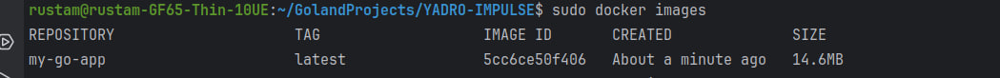

# YADRO-IMPULSE

---

Этот проект представляет собой прототип системы управления компьютерным клубом, которая обрабатывает события, подсчитывает выручку за день и время занятости каждого стола.

## Запуск проекта

### Системные требования

Проект разработан на языке Go (версия 1.19 и выше). Для запуска в контейнере Docker требуется наличие Docker Engine.

### Запуск с использованием Docker

1. Склонируйте репозиторий с проектом:

   ```bash
   git clone https://github.com/Anoke/YADRO-IMPULSE
   ```

2. Соберите Docker-образ:

   стандартный образ
   ```bash
   docker build -t computer-club-manager .
   ```
   создание образа с вводом нужного инпут файла
   ```bash
   docker build --build-arg="FILE_NAME=<path_to_your_file>" -t computer-club-manager .
   ```
   Замените `path_to_your_file` на необходимое значение для вашего файла с входными данными

   

3. Запустите контейнер с помощью созданного образа, указав необходимые параметры:

   ```bash
   docker run -it --name club-container computer-club-manager:latest
   ```

### Входные данные

Программа принимает входные данные из текстового файла, который передается в качестве аргумента командной строки при запуске программы.

Формат входных данных описан следующим образом:

- Первая строка содержит количество столов в компьютерном клубе.
- Вторая строка задает время начала и окончания работы компьютерного клуба.
- Третья строка определяет стоимость часа в компьютерном клубе.
- Затем идут события, каждое событие на отдельной строке.

Пример входных данных:

```
3
09:00 19:00
10
08:48 1 client1
09:41 1 client1
09:48 1 client2
...
```

### Выходные данные

Программа выводит результат работы в стандартный вывод.

Пример выходных данных:

```
09:00
08:48 1 client1
09:41 1 client1
09:48 1 client2
...
19:00
1 70 05:58 
2 30 02:18
3 90 08:01
```

## [Тестовое задание GO](%D0%A2%D0%B5%D1%81%D1%82%D0%BE%D0%B2%D0%BE%D0%B5%20%D0%B7%D0%B0%D0%B4%D0%B0%D0%BD%D0%B8%D0%B5%20GO.docx)